# Quant Trading Task

A four-part, end-to-end systematic equity strategy pipeline built on a
100-asset daily OHLCV dataset (2016-2026, ~10 years): data cleaning and
causal feature engineering, walk-forward ensemble modeling, an
out-of-sample long/short backtest with transaction costs, and a
statistical-arbitrage (pairs trading) overlay.

The project is designed around one non-negotiable principle: **at every
step, the model and the strategy only ever see information that would have
been available at the time**. Every split boundary, retraining step, and
statistic is documented with *why* it cannot leak future information into
the past. See [Methodology & no-leakage design](#methodology--no-leakage-design)
for the details.


---

## Project structure

```
StatArb-Pipeline/
├── Part1_Data_Cleaning_Feature_Engineering.ipynb   # load, clean, engineer features
├── Part2_Model_Training_Strategy.ipynb             # walk-forward ensemble + IC analysis
├── Part3_Backtesting_Analysis.ipynb                # long/short backtest, costs, alpha/beta
├── Part4_Statistical_Arbitrage.ipynb               # pairs-trading overlay + blending
├── src/
│   ├── __init__.py
│   ├── config.py        # single source of truth: split dates, strategy params
│   ├── data_loader.py    # raw CSVs -> long-format panel
│   ├── cleaning.py        # OHLC integrity fixes, causal outlier capping
│   ├── features.py         # ~30 causal technical/cross-sectional features
│   ├── walkforward.py       # expanding-window+embargo folds, ensemble training, IC
│   ├── backtester.py         # long/short decile portfolio, costs, performance metrics
│   ├── stat_arb.py            # pair selection, cointegration, pairs backtest
│   └── metrics.py              # shared performance-metric helpers
├── data/                 # gitignored — raw + processed data (see Setup)
├── outputs/
│   ├── figures/          # all PNG plots referenced below
│   └── tables/            # all CSV result tables referenced below
├── requirements.txt

```

---

## Data

**Source**: [Quant Task dataset](https://www.kaggle.com/datasets/iamspace/precog-quant-task-2026)
on Kaggle — 100 anonymized assets (`Asset_001` … `Asset_100`), daily OHLCV,
2016-01-25 to 2026-01-16 (2,511 trading days each, fully aligned calendar).

The raw data is essentially pristine: no missing values, no non-positive
prices or negative volumes, and every ticker shares the same trading
calendar. The only defect found was a handful of floating-point
OHLC-ordering violations (e.g. `high` very slightly below `close`), fixed in
Part 1.

---

## Setup & reproduction

```bash
# 1. Clone and create a virtual environment (Python 3.11+)
cd PRECOG
python -m venv .venv
source .venv/Scripts/activate   # Windows; use `source .venv/bin/activate` on macOS/Linux
pip install -r requirements.txt

# 2. Get a Kaggle API token (kaggle.com -> Account -> Create New Token),
#    save it as kaggle.json, then:
#    Windows:      copy kaggle.json %USERPROFILE%\.kaggle\kaggle.json
#    macOS/Linux:  cp kaggle.json ~/.kaggle/kaggle.json && chmod 600 ~/.kaggle/kaggle.json

# 3. Download the data
kaggle datasets download -d iamspace/precog-quant-task-2026 -p data/raw --unzip

# 4. Run the notebooks in order (each writes inputs the next one reads)
jupyter nbconvert --to notebook --execute --inplace Part1_Data_Cleaning_Feature_Engineering.ipynb
jupyter nbconvert --to notebook --execute --inplace Part2_Model_Training_Strategy.ipynb
jupyter nbconvert --to notebook --execute --inplace Part3_Backtesting_Analysis.ipynb
jupyter nbconvert --to notebook --execute --inplace Part4_Statistical_Arbitrage.ipynb
```

Each notebook reads its inputs from `data/processed/` and writes figures to
`outputs/figures/` and tables to `outputs/tables/`. Total runtime is a few
minutes (Part 2's walk-forward ensemble training is the slowest step, ~1
minute for all 7 folds).

---

## Methodology & no-leakage design

### Timeline

The full sample (2016-01-25 → 2026-01-16) is split once, in `src/config.py`,
and every notebook imports those constants — there is a single source of
truth for the split boundaries:

| Period | Range | Role |
|---|---|---|
| **Train** | 2016-01-25 → 2019-12-31 | Initial walk-forward training window |
| **Validation** | 2020-01-01 → 2021-12-31 | Strategy/hyperparameter selection (decile size, rebalance frequency, stat-arb thresholds) |
| **Test** | 2022-01-01 → 2026-01-16 (~4 years) | Final, single, out-of-sample backtest |

### Part 1 — Data Cleaning & Feature Engineering

- Fixes the small OHLC-ordering violations and flags (without removing)
  extreme returns relative to each ticker's own trailing 252-day history.
- Engineers **32 features per (date, ticker)**, all causal — built from
  rolling windows, EWMs, or `.shift()` on a single ticker's own history:
  returns (1/5/10/21-day), RSI, MACD, ATR, Bollinger Bands, realized
  volatility, OBV, moving-average ratios, plus cross-sectional rank/z-score
  versions of select features (computed **per date**, using only that date's
  cross-section — never a future date).
- The exploratory "does this feature carry signal" IC check (Section 3) is
  computed **on the training period only**, so no distributional or
  predictive-power statistic is contaminated by validation/test data.
- Saves `data/processed/features.parquet` containing only features + `close`
  + `date` + `ticker` — **no forward-return/target column is ever saved**,
  so Part 2 cannot accidentally train on a leaked label.

### Part 2 — Model Training & Strategy Formulation

- **Target**: 5-day forward return, **cross-sectionally demeaned** — i.e.
  each name's excess return vs. the equal-weight universe average over the
  next 5 trading days. This is the natural target for a ranking/long-short
  strategy and ties directly to the evaluation metric (IC).
- **Walk-forward ensemble**: Ridge regression + LightGBM + Logistic
  Regression, **refit from scratch every year** (2020–2026, 7 folds) on an
  expanding window. An **embargo of 5 trading days** (= the target horizon)
  is dropped immediately before each retrain cutoff, so no training label's
  forward-return window overlaps the holdout year that follows.
- Each model's holdout predictions are cross-sectionally z-scored per date,
  and the three z-scores are averaged into a single ensemble `score`.
- **Evaluation**: Information Coefficient (daily cross-sectional Spearman
  correlation between `score` and the realized 5-day forward return),
  computed purely on each fold's out-of-sample holdout.
- **Strategy hyperparameters** (decile size, rebalance frequency) are
  selected via a small grid search **evaluated only on the validation
  period (2020-2021)**, net of 10bps costs. The test period is never touched
  during this selection.
- Saves `data/processed/oos_scores.csv`: every (date, ticker) OOS row for
  2020-2026, used by Part 3 (test period) and Part 4 (train+validation
  period).

### Part 3 — Backtesting & Performance Analysis

- Takes the validation-selected configuration (`n_long = n_short = 10`,
  `rebalance_freq = 10` days, `10bps` one-way transaction cost on turnover)
  and runs **one, final backtest on the test period (2022-2026)** — no
  parameter is tuned here.
- Reports the full metric suite (Sharpe, Sortino, Calmar, drawdown, turnover,
  ...) with and without transaction costs, against an equal-weight
  buy-and-hold benchmark of all 100 names.
- Includes a transaction-cost sensitivity comparison against a "naive"
  5-day rebalance (i.e., rebalancing exactly as often as the prediction
  horizon — the choice one might make without any cost-aware tuning).
- **Alpha/beta decomposition**: regresses the strategy's daily net return on
  the benchmark's daily return (`statsmodels` OLS) to separate
  market-explained (`beta`) return from idiosyncratic (`alpha`) return.

### Part 4 — Statistical Arbitrage Overlay

- **Pair selection is performed only on the formation period (2016-2021)**:
  a correlation pre-screen on log prices (`|corr| > 0.8`), followed by an
  Engle-Granger cointegration test (`p < 0.01`), with hedge ratios estimated
  by OLS — all on formation-period data only.
- The selected pairs and their hedge ratios are then **frozen** and
  backtested **entirely out-of-sample on 2022-2026** using a standard,
  untuned rolling-z-score mean-reversion rule (60-day window, entry at
  `|z| > 2`, exit at `|z| < 0.5`, stop-loss at `|z| > 4`).
- Reports a multiple-testing discussion (observed vs. chance-expected count
  of significant pairs, Bonferroni-corrected threshold) and shows the
  aggregated stat-arb portfolio's OOS performance.
- Analyzes blending the stat-arb overlay with the Part 3 long/short strategy
  via the two-asset portfolio variance formula, sweeping the capital split.

---

## Results

### Part 1 — Data & Features

The training-period IC sanity check confirms several hand-built features
carry small but non-trivial signal (|mean IC| in the 0.01–0.03 range, as
expected for noisy daily equity data) — `atr_14`, `realized_vol_10/20`, and
`rsi_14` show the strongest (still modest) train-period IC.

| | |
|---|---|
| 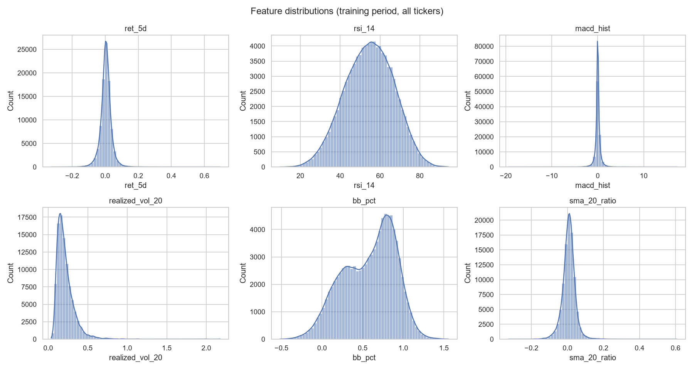 | 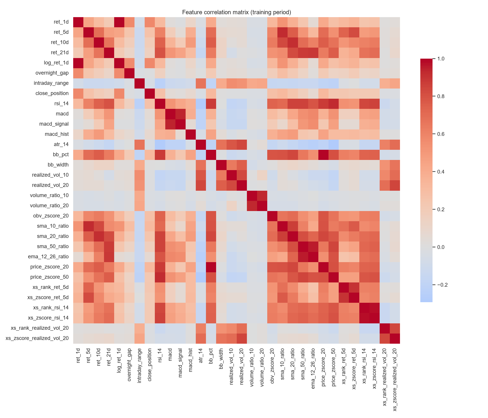 |
| 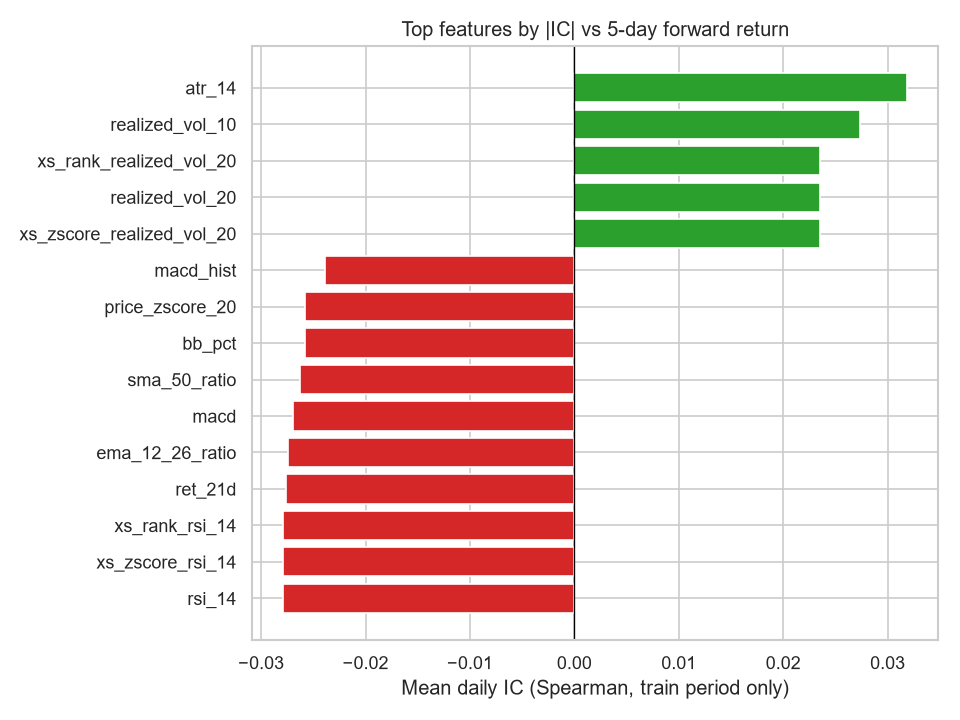 | |

### Part 2 — Walk-Forward Ensemble & IC

The ensemble's out-of-sample IC is positive in 6 of 7 walk-forward folds
(2020–2026), with one negative fold (2022) — consistent with a genuinely
noisy signal rather than an overfit one. The ensemble's IC is at least as
good as any single component model in aggregate.

| Fold | Mean IC | IC IR | Hit rate | n days |
|---|---|---|---|---|
| 2020 | 0.0258 | 0.099 | 0.506 | 253 |
| 2021 | 0.0057 | 0.024 | 0.488 | 252 |
| 2022 | -0.0175 | -0.057 | 0.466 | 251 |
| 2023 | 0.0491 | 0.269 | 0.568 | 250 |
| 2024 | 0.0304 | 0.151 | 0.579 | 252 |
| 2025 | 0.0158 | 0.075 | 0.516 | 250 |
| 2026 (partial) | 0.0088 | 0.075 | 0.333 | 6 |

| Model | Mean IC (2020-2026) | IC IR |
|---|---|---|
| Ridge | 0.0157 | 0.066 |
| LightGBM | 0.0099 | 0.050 |
| Logistic | 0.0160 | 0.068 |
| **Ensemble** | **0.0182** | **0.077** |

| | |
|---|---|
| 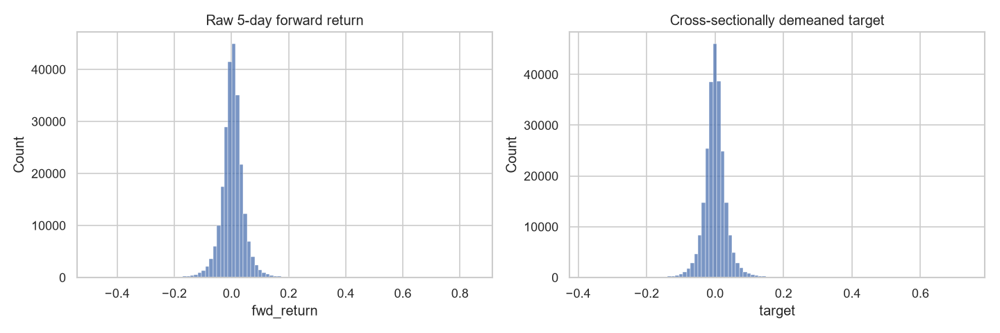 | 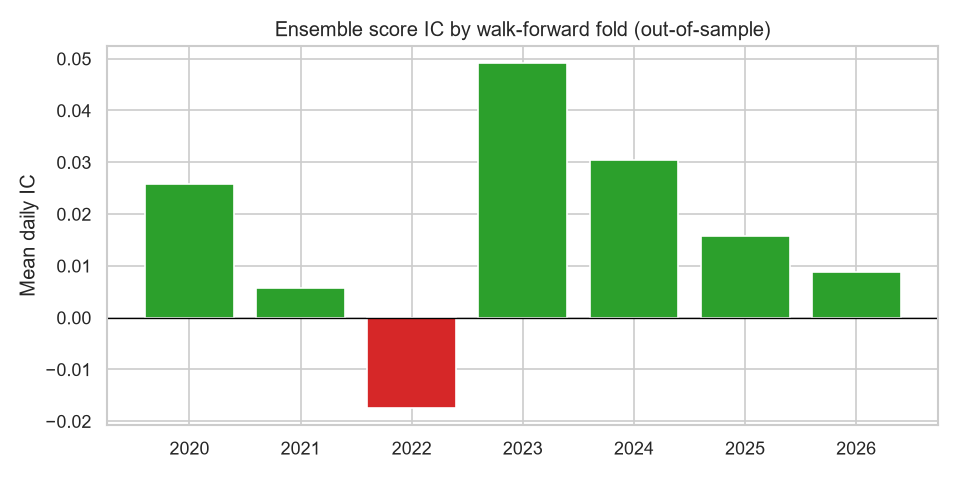 |
| 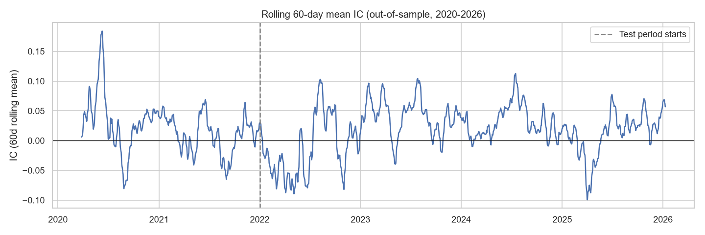 | 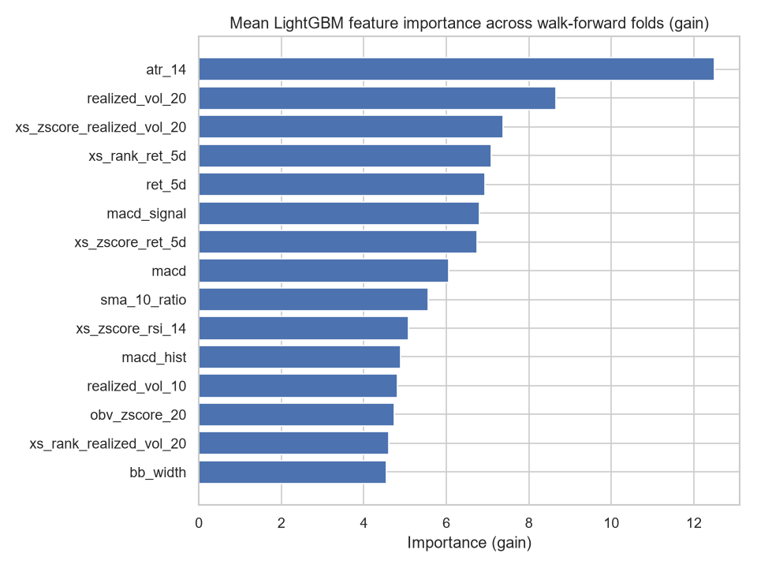 |
| 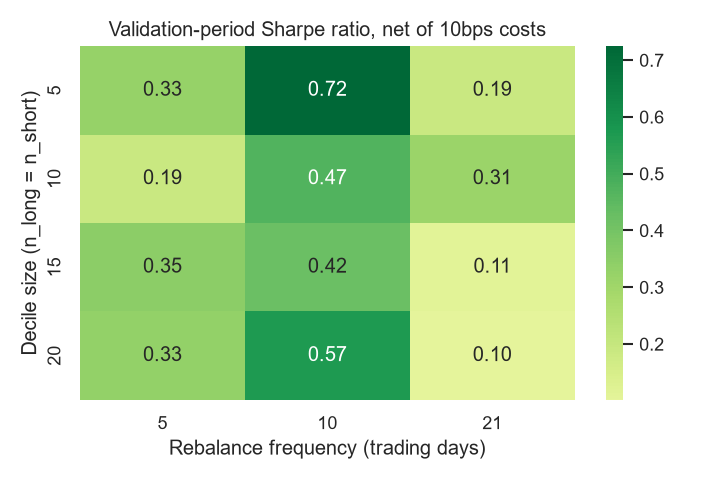 | |

`atr_14`, `realized_vol_20`, and the cross-sectional z-score/rank of
`realized_vol_20` and `ret_5d` are the most important LightGBM features,
averaged across all 7 folds.

### Part 3 — Out-of-Sample Backtest (2022-2026)

Configuration: `n_long = n_short = 10` (out of 100 names), rebalanced every
10 trading days, 10bps one-way transaction cost — selected on 2020-2021 data
only, then run once on 2022-2026.

| Metric | Strategy (with costs) | Strategy (no costs) | Equal-weight benchmark |
|---|---|---|---|
| Total return | 27.9% | 62.3% | 66.1% |
| Annualized return | 6.3% | 12.8% | 13.4% |
| Annualized volatility | 26.5% | 26.5% | 15.1% |
| Sharpe ratio | 0.36 | 0.59 | 0.91 |
| Max drawdown | -25.7% | -23.2% | -19.5% |

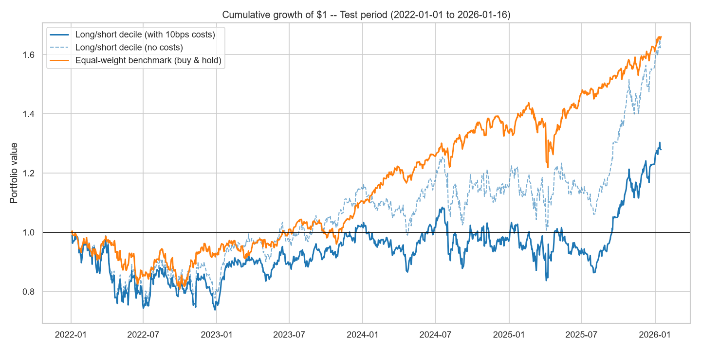

Over this ~4-year OOS window, the equal-weight benchmark (a strong bull
market for the universe overall) outperforms the long/short strategy on a
raw-return and Sharpe basis. 10bps costs at the validation-selected
10-day rebalance cut the strategy's gross annualized return roughly in half
(12.8% → 6.3%), but the strategy still clears the naive 5-day-rebalance
alternative by a wide margin (see cost sensitivity below) — i.e. the
cost-aware hyperparameter selection in Part 2 mattered.

| | |
|---|---|
| 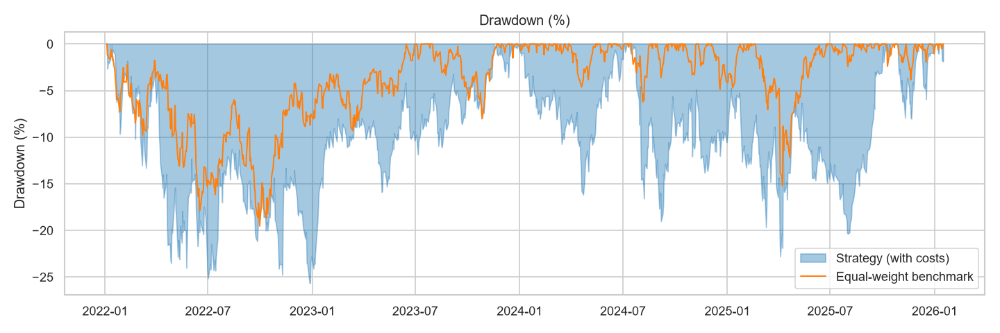 | 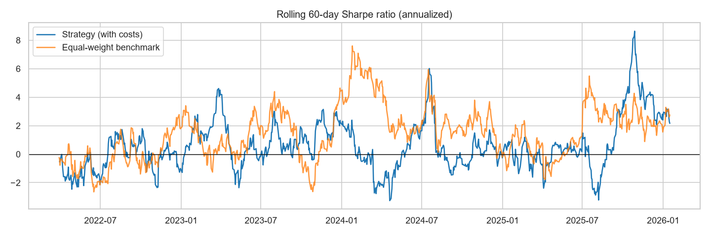 |
| 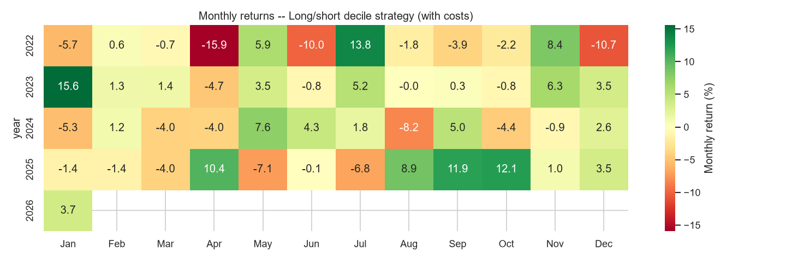 | 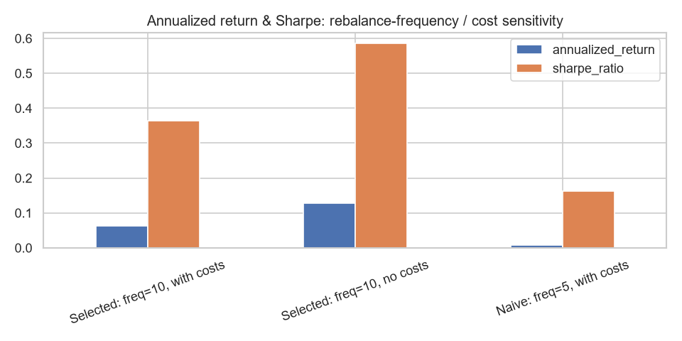 |

**Transaction cost sensitivity**:

| | Selected: freq=10, with costs | Selected: freq=10, no costs | Naive: freq=5, with costs |
|---|---|---|---|
| Annualized return | 6.3% | 12.8% | 0.8% |
| Sharpe ratio | 0.36 | 0.59 | 0.16 |
| Max drawdown | -25.7% | -23.2% | -29.0% |
| Calmar ratio | 0.25 | 0.55 | 0.03 |

**Alpha / beta decomposition** (CAPM-style regression of strategy returns on
the benchmark):

| | Value |
|---|---|
| Beta | 0.92 (p ≈ 9.8e-74, R² = 0.28) |
| Annualized alpha | -3.1%/yr (p = 0.78, **not significant**) |

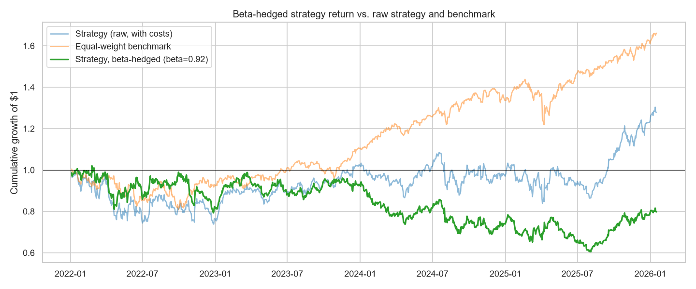

**Honest finding**: despite being dollar-neutral *in weights* (gross long =
gross short = 100%), this long/short book's realized P&L carries a
**highly significant beta of ~0.92** to the broad benchmark — dollar
neutrality does not imply beta neutrality. The mechanism: in a generally
upward-trending sample, the momentum-style ensemble score correlates with
each stock's *individual* sensitivity to the common market factor, so the
long book ends up systematically higher-beta than the short book. The
annualized alpha (-3.1%/yr) is small and statistically indistinguishable
from zero (p = 0.78) — i.e. **this strategy's P&L over 2022-2026 is mostly
explained by its market exposure, not by genuine idiosyncratic skill**. This
motivates Part 4's market-neutral overlay.

### Part 4 — Statistical Arbitrage Overlay (OOS 2022-2026)

**Pair selection** (formation period 2016-2021 only): of ~2,807
correlation-screened pairs (`|corr| > 0.8`), 78 pass the Engle-Granger
cointegration test at `p < 0.01` — vs. ~28 expected by chance at that
threshold, suggesting genuine structure beyond multiple-testing noise. Only
the single most significant pair survives a Bonferroni correction across all
~2,807 tests (significance threshold ≈ 1.78e-05). The top 5 pairs by
cointegration p-value were selected and their hedge ratios frozen:

| Pair | Correlation | Coint. p-value | Hedge ratio |
|---|---|---|---|
| Asset_062 / Asset_077 | 0.989 | 5.0e-06 | 1.255 |
| Asset_038 / Asset_051 | 0.977 | 1.1e-04 | 1.211 |
| Asset_081 / Asset_096 | 0.984 | 1.5e-04 | 2.414 |
| Asset_092 / Asset_093 | 0.937 | 2.4e-04 | 0.527 |
| Asset_020 / Asset_035 | 0.986 | 4.8e-04 | 0.964 |

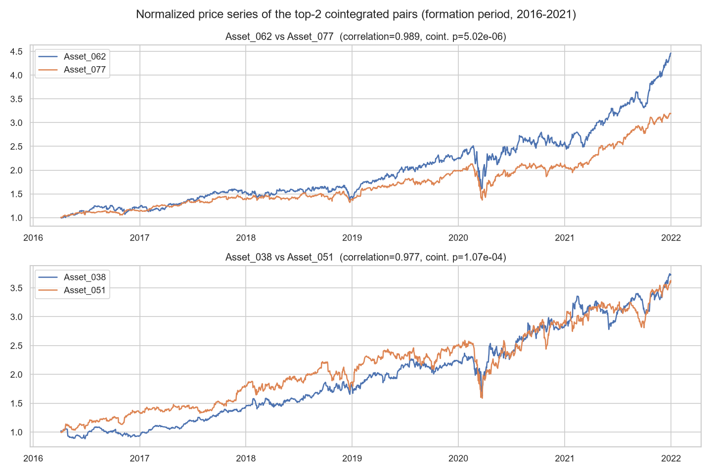

**OOS per-pair results (2022-2026)**, annualized return / Sharpe:

| Pair | Ann. return | Sharpe |
|---|---|---|
| Asset_062 / Asset_077 | -3.6% | -0.35 |
| Asset_038 / Asset_051 | 8.7% | 1.06 |
| Asset_081 / Asset_096 | 0.4% | 0.09 |
| Asset_092 / Asset_093 | 9.8% | 0.85 |
| Asset_020 / Asset_035 | 1.9% | 0.26 |

Notably, **Asset_062/Asset_077** — the single most statistically
significant pair, and the only one surviving Bonferroni correction — is
among the *worst* OOS performers. This is a textbook illustration of why a
low in-sample p-value (how unlikely the historical co-movement was to arise
by chance) does not predict OOS profitability, and why pairs must always be
validated out-of-sample.

| | |
|---|---|
| 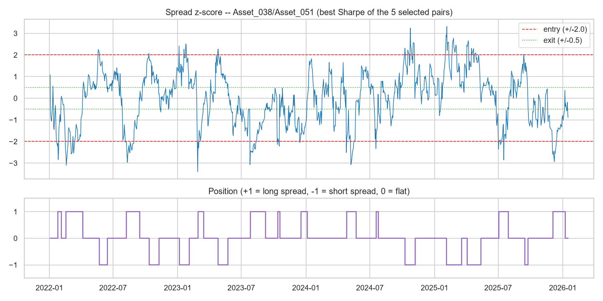 | 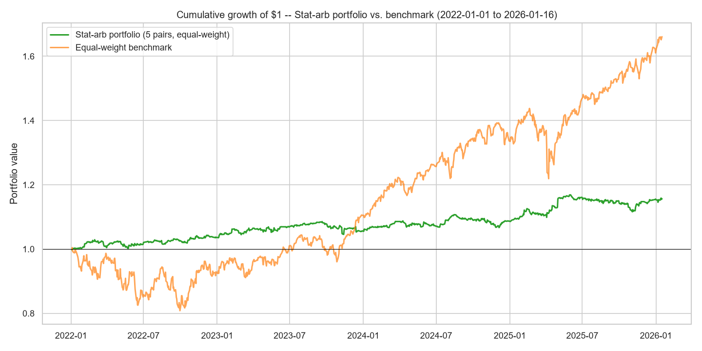 |
| 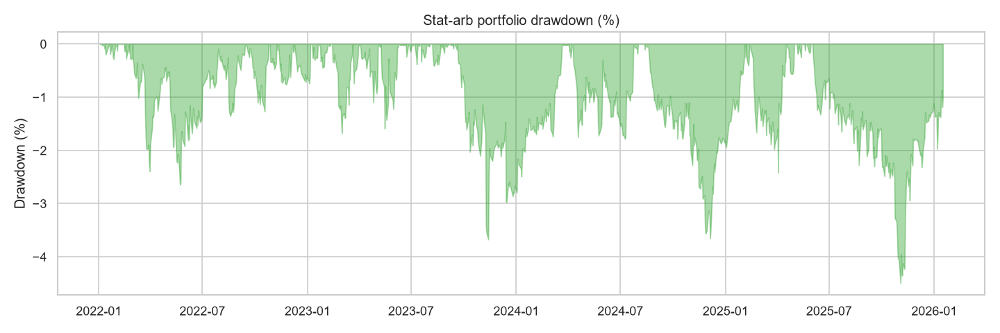 | 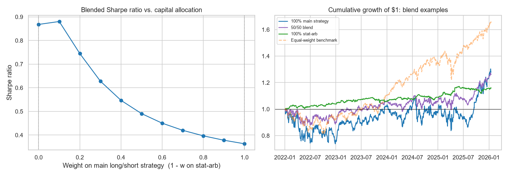 |

**Aggregated stat-arb portfolio (equal-weight, 5 pairs) vs. benchmark, OOS 2022-2026:**

| Metric | Stat-arb portfolio | Equal-weight benchmark |
|---|---|---|
| Total return | 15.7% | 66.1% |
| Annualized return | 3.7% | 13.4% |
| Annualized volatility | 4.3% | 15.1% |
| Sharpe ratio | **0.85** | 0.91 |
| Max drawdown | -4.5% | -19.5% |

**Blending with Part 3's strategy**: the correlation between the two daily
return streams is low (~0.10). **Honest finding**: over this test period,
the stat-arb portfolio's *standalone* Sharpe (~0.85-0.87, depending on exact
date alignment) actually exceeds the main long/short strategy's (~0.36) —
this is not a case of "a low-Sharpe diversifier helping anyway"; the
pairs-trading book is the stronger return stream on its own here. The
Sharpe-maximizing blend is around `w_main ≈ 0.1` (≈90% stat-arb / 10% main
strategy, blended Sharpe ≈ 0.88), only marginally above pure stat-arb:

| w (main strategy) | Ann. return | Ann. volatility | Sharpe | Max drawdown |
|---|---|---|---|---|
| 0.0 (pure stat-arb) | 3.7% | 4.3% | 0.87 | -4.5% |
| 0.1 | 4.3% | 4.9% | **0.88** | -4.3% |
| 0.5 | 5.9% | 13.6% | 0.49 | -12.3% |
| 1.0 (pure main strategy) | 6.3% | 26.5% | 0.36 | -25.7% |

---

## Honest discussion & limitations

This project was built to avoid common quant-research pitfalls — look-ahead
bias in features/targets, in-sample hyperparameter and pair selection, and
narratives that don't match the numbers. A few results are worth calling out
explicitly because they *don't* match the "textbook expected" outcome, and
are reported as found rather than adjusted to fit a preconceived story:

- **The long/short strategy underperforms the benchmark over 2022-2026.**
  This is a single ~4-year OOS window dominated by a broad bull market for
  this universe; a momentum/cross-sectional ranking strategy is not
  guaranteed to beat buy-and-hold in every regime, and it didn't here.
- **The "dollar-neutral" book is not beta-neutral** (beta ≈ 0.92,
  significant). Dollar neutrality (equal long/short notional) is a
  *portfolio construction* property; beta neutrality is a *risk* property,
  and the two only coincide if the long and short books happen to have
  similar average betas — which they don't here, because the score itself
  correlates with individual-stock beta.
- **Annualized alpha is small and not statistically significant**
  (p = 0.78). Over this sample, the strategy's P&L is mostly explained by
  its incidental market exposure rather than by genuine idiosyncratic skill.
- **The stat-arb overlay outperforms the main strategy on a risk-adjusted
  basis** (Sharpe 0.85 vs 0.36) and the optimal blend is mostly stat-arb,
  not a small allocation to it. This may say more about *this specific*
  10-year sample (the formation period happened to contain genuinely
  cointegrated pairs that persisted) than about pairs trading in general —
  a single sample is not strong evidence either way.
- **Only one of 78 "significant" pairs survives Bonferroni correction**, and
  it performs poorly OOS — a reminder that with ~2,800 simultaneous
  hypothesis tests, even a `p < 0.01` threshold will produce dozens of false
  positives by chance alone.
- **Sample size**: all results are from one ~10-year history of 100
  anonymized assets. Walk-forward retraining and an OOS test period reduce
  (but cannot eliminate) the risk that these specific numbers are a property
  of this one historical path rather than a generalizable edge.

---

## Tech stack

Python, pandas, NumPy, scikit-learn, LightGBM, statsmodels, matplotlib,
seaborn, Jupyter. See `requirements.txt` for exact version constraints.
